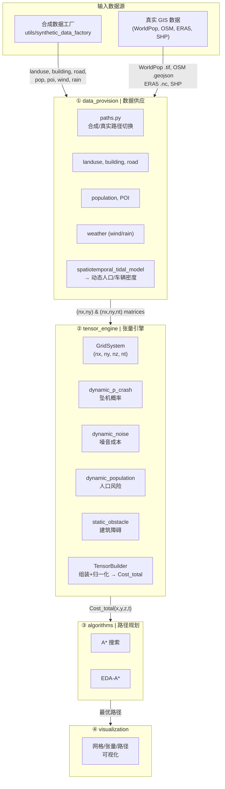
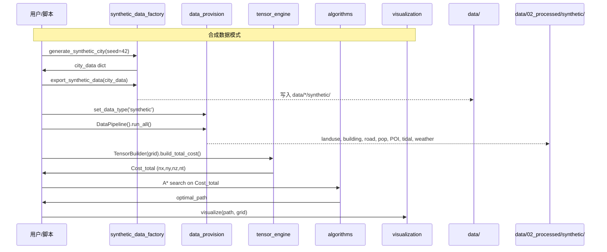

# spatiotemporal_heterogeneity 项目规范

> 写给 AI 同行的项目速览，聚焦**模块职责边界**与**数据流向**。

## 1. 项目定位

研究**时空异质性**对无人机低空航路风险的影响。核心产出一条四维代价张量 `Cost_total(x,y,z,t)`，供 A* 路径规划使用。

## 2. 目录结构速览

```
methods/spatiotemporal_heterogeneity/
├── data/              # 三阶段数据流水线
│   ├── 01_raw/        #   原始 GIS 输入 (.tif/.shp/.nc)
│   │   └── synthetic/ #   合成数据原始输入
│   ├── 02_processed/  #   对齐后的 NumPy 矩阵 (.npy/.npz)
│   │   └── synthetic/ #   合成数据处理后
│   └── 03_tensors/    #   最终张量 (.npy)
│       └── synthetic/
├── src/               # 核心源码
│   ├── data_provision/    # ① 数据供应层
│   ├── tensor_engine/     # ② 张量引擎层
│   ├── algorithms/        # ③ 路径规划算法
│   └── visualization/     # ④ 可视化
├── utils/             # 工具
│   └── synthetic_data_factory/  # 合成城市生成器
├── configs/           # YAML 配置文件
├── scripts/           # 启动/导出脚本
├── experiments/       # 实验脚本
├── tests/             # 测试
└── output/            # 可视化输出
```

## 3. 核心数据流



## 4. 模块职责与边界

### 4.1 `data_provision/` — 数据供应层

| 职责 | 负责 | 不负责 |
|------|------|--------|
| 原始 GIS → 对齐 NumPy | ✅ | ❌ 风险张量 |
| 合成/真实一键切换 | ✅ | ❌ 路径规划 |
| 六类数据：landuse, building, road, pop, POI, weather | ✅ | ❌ 可视化 |

**输出约定**：所有矩阵空间维度 `(nx, ny)`，潮汐密度 `(nx, ny, nt)`，永远不扩展高度维 `nz`（由 `tensor_engine` 广播）。

**关键接口**：
```python
from data_provision import set_data_type, get_data_paths
from data_provision.pipeline import DataPipeline

set_data_type('synthetic')  # 或 'real'
pipeline = DataPipeline()
result = pipeline.run_all()  # 一键处理所有数据
```

### 4.2 `tensor_engine/` — 张量引擎层

| 子模块 | 职责 |
|--------|------|
| `grid_system.py` | 定义四维网格 `(nx,ny,nz,nt)`，坐标轴，GridSystem |
| `load_config.py` | 加载 YAML 配置 → EasyDict |
| `dynamic_p_crash.py` | 动态坠机概率：`P_crash = 1-exp(-λ·Φ·Δt)`，Φ 融合风×雨×峡谷 |
| `dynamic_population.py` | 人口风险成本（基于潮汐密度） |
| `dynamic_noise.py` | 噪声社会敏感度成本（土地利用×时间） |
| `static_obstacle.py` | 静态建筑障碍与峡谷效应 |
| `tensor_builder.py` | **数据出口**：组装所有组件 → `Cost_total(x,y,z,t)` |

**职责边界**：唯一允许**扩展高度维 `nz`** 并**输出 4D 风险张量**的模块。

### 4.3 `algorithms/` — 路径规划

| 子模块 | 职责 |
|--------|------|
| `a_star/` | 标准 A* 三维路径搜索 |
| `eda_a_star/` | 融合环境风险的 A* 变体 |

**输入**：`tensor_engine` 输出的 `Cost_total` 张量。

**职责边界**：只做路径搜索。不生成代价，不处理数据，不画图。

### 4.4 `visualization/` — 可视化

将网格、张量切片、路径结果可视化（Plotly / Matplotlib），输出到 `output/`。

### 4.5 `utils/synthetic_data_factory/` — 合成城市生成器

**统一入口**：
```python
from utils.synthetic_data_factory import generate_synthetic_city, export_synthetic_data

city = generate_synthetic_city(nx, ny, nz, nt, seed=42)
export_synthetic_data(city, seed=42)  # 写入 data/*/synthetic/
```

生成顺序严格约束：landuse → road → building → POI → population → weather → OD。seed 确定性可复现。

**职责边界**：只生成数据并写入磁盘。不处理、不构建张量、不规划路径。

### 4.6 `configs/` — 配置文件

| 文件 | 内容 |
|------|------|
| `env_config.yaml` | 网格维度、时间步长、飞行参数、数据源 |
| `risk_params.yaml` | 坠机概率、人口、噪音、财产损失模型参数 |
| `cost_weight.yaml` | 各项代价的权重系数 |

### 4.7 `scripts/` — 启动脚本

`export_synthetic_data.py`：调用 `synthetic_data_factory` 生成并导出合成数据到 `data/` 管线。

## 5. 数据维度坐标系

| 维度 | 符号 | 示例值 | 说明 |
|------|------|--------|------|
| X | `nx` | 40 (micro) / 100 (macro) | 水平东-西 |
| Y | `ny` | 40 / 100 | 水平南-北 |
| Z | `nz` | 12 | 垂直高度层，仅在 `tensor_engine` 扩展 |
| T | `nt` | 24 (小时) / 96 (15min粒度) | 时间片 |

- `data_provision` 输出 `(nx, ny)` 或 `(nx, ny, nt)`
- `tensor_engine` 负责广播到 `(nx, ny, nz, nt)`

## 6. 典型工作流



## 7. 给 AI 协作者的提示

1. **不要跨层调用**：`data_provision` 的输出不进 `algorithms`，必须经过 `tensor_engine`
2. **高度维只在 `tensor_engine` 处理**：其他模块一律用 `(nx, ny)` 或 `(nx, ny, nt)`
3. **合成/真实路径自动切换**：先调 `set_data_type()`，再用 `get_data_paths()` 拿路径，不要硬编码
4. **可复现性**：所有随机模块接受 `seed` 参数，使用局部 `RandomState`
5. **配置驱动**：算法参数从 `configs/*.yaml` 读取，不在代码中硬编码
6. **土地利用编码约定**：`1=住宅, 2=商业, 3=机构, 4=工业, 5=道路, 6=绿地/水域`
